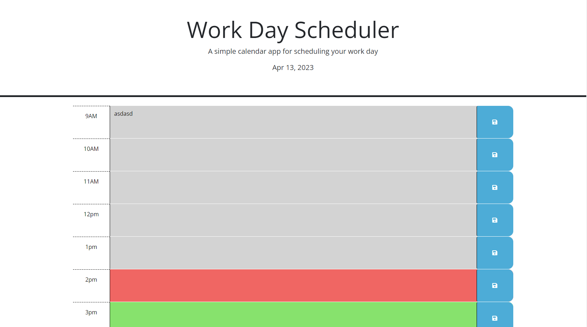

# Work-Day-Scheduler-API

## Link to Deployed Application

https://milywayz.github.io/Work-Day-Scheduler-API/

## Description

This webpage works as a daily planner to help schedule your day out by saving text for certain times of the day.

## Installation

N/A

## Usage

Webpage Layout

## License

N/A

## Features

Working Current Date 
Changing Color of rows depending on past, present, and future current time 
Saving Text for specific times